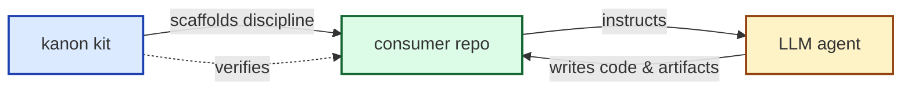
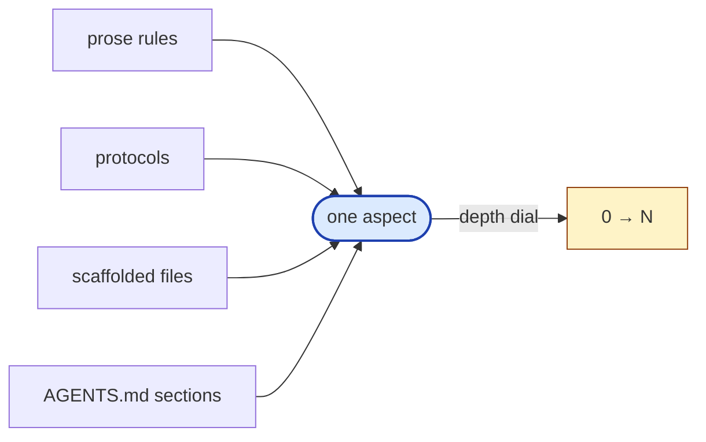
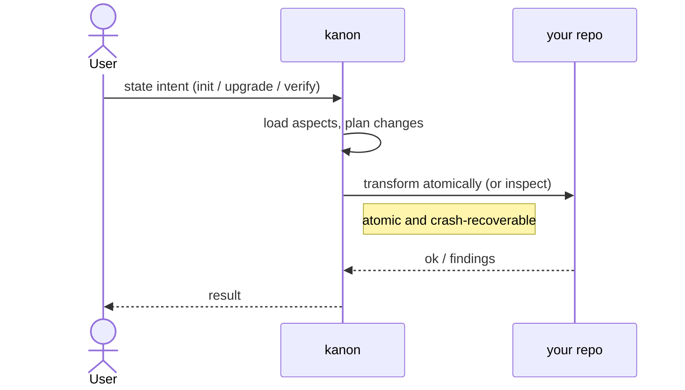
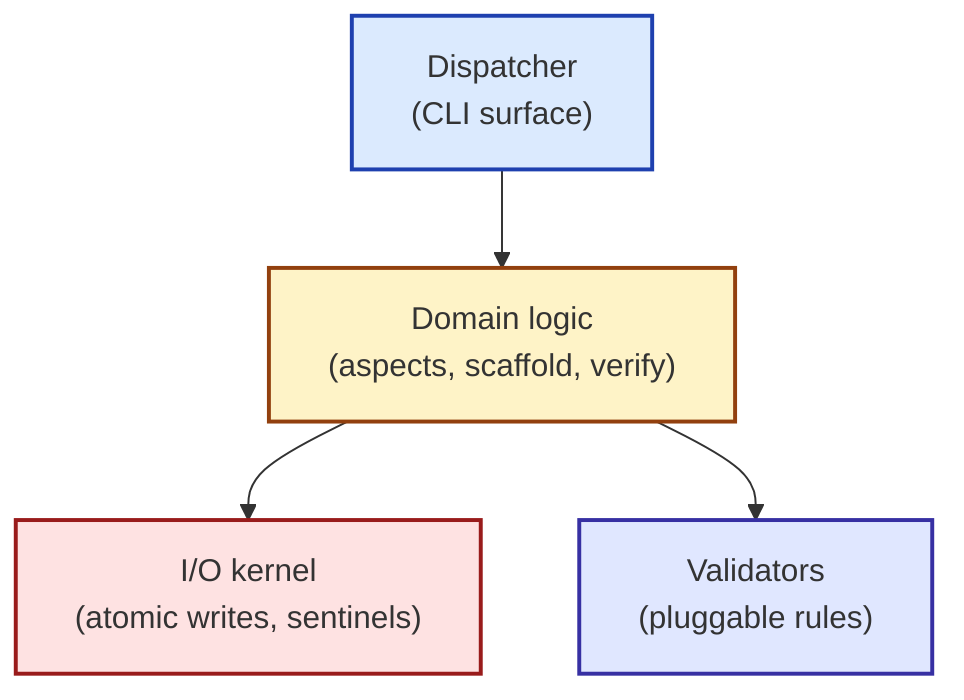
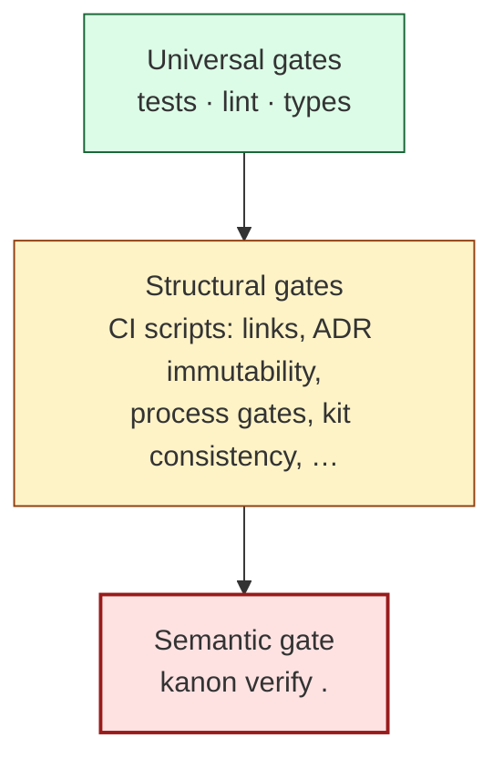

# Contributing to kanon

A guide for new human contributors. Reads top-to-bottom; you can stop at any section once you have what you need. If you are an LLM agent, read [`AGENTS.md`](../AGENTS.md) instead — it routes by trigger, not by intent.

This doc walks **abstract → concrete**: mental model first, then the aspect model, then runtime behaviour, then the source tree, then where your change goes, then CI gates, then the workflow end-to-end, then prohibitions.

For *why* the kit is shaped this way, follow links to ADRs in [`docs/decisions/`](decisions/) and design docs in [`docs/design/`](design/). This doc is a router, not a re-derivation.



## 1. What kanon is, in one screen

kanon is a **portable, self-hosting kit** that packages development disciplines (Spec-Driven Development, worktree isolation, release discipline, …) as **prose an LLM agent reads and obeys**. A consumer runs `kanon init`, opens the project in Claude Code / Cursor / Codex / etc., and the agent reads the scaffolded `AGENTS.md` and follows the protocols it routes to.

Three properties define the kit ([vision.md](foundations/vision.md)):

- **Portable.** Same `AGENTS.md` works across nine harnesses via shim files. New harnesses are a data-file edit.
- **Aspect-oriented.** Disciplines are opt-in *aspects* with depth dials. Enable only what you need; grow without ceremony you don't need yet.
- **Self-hosting.** This repo is itself a kanon project at `kanon-sdd:3` + `kanon-worktrees:2` + others. `packages/kanon-core/src/kanon_core/kit/` (the bundle the kit ships) and `docs/` (the kit's own SDD artifacts) share source-of-truth, CI-enforced. *If you can't use the kit to develop the kit, the kit isn't good enough.*

That self-hosting twist is the most surprising thing about the codebase: **the same code that templates consumer repos templates this repo**. `packages/kanon-aspects/src/kanon_aspects/aspects/kanon_<local>/` and `docs/` + `.kanon/` look duplicative until you realize the former is the source-of-truth and the latter is an instance of it.

For more: [`README.md`](../README.md) (install + quickstart), [`docs/foundations/vision.md`](foundations/vision.md) (the long form), [`docs/foundations/principles/README.md`](foundations/principles/README.md) (the *why*).

## 2. The aspect model in 90 seconds

An **aspect** is an opt-in bundle of (prose rules + protocols + AGENTS.md sections + scaffolded files), each with a **depth dial** (0–N). Most new behaviour lands inside *one aspect*, not across the kit. Knowing which aspect your change belongs to is half the navigation work.



The 7 kit-shipped aspects (canonical roster: [`docs/reference-aspects.md`](reference-aspects.md), generated from `pyproject.toml`'s entry-points + per-aspect manifests):

| Aspect | Stability | Depth range | Default | What it gives you |
|---|---|---|---:|---|
| `kanon-sdd` | **stable** | 0–3 | 1 | Plans, specs, design docs, foundations |
| `kanon-worktrees` | experimental | 0–2 | 1 | Worktree isolation prose + shell helpers |
| `kanon-release` | experimental | 0–2 | 1 | Release checklist, preflight, `kanon release` gate |
| `kanon-testing` | experimental | 0–3 | 1 | Test discipline, AC-first TDD, error diagnosis |
| `kanon-security` | experimental | 0–2 | 1 | Secure-defaults protocol + CI scanner |
| `kanon-deps` | experimental | 0–2 | 1 | Dependency hygiene + CI scanner |
| `kanon-fidelity` | experimental | 0–1 | 1 | Behavioural conformance via lexical assertions |

Default `kanon init` enables 5 of the 7 (`kanon-sdd`, `kanon-testing`, `kanon-security`, `kanon-deps`, `kanon-worktrees`); `kanon-release` and `kanon-fidelity` are opt-in (per the profile defaults in [`packages/kanon-core/src/kanon_core/cli.py`](../packages/kanon-core/src/kanon_core/cli.py) `_PROFILES`). Aspects compose via a `provides:` capability registry — a dependent's `requires: ["planning-discipline"]` is satisfied by *any* enabled aspect that declares the capability, kit-shipped or project-defined ([ADR-0026](decisions/0026-aspect-provides-and-generalised-requires.md)).

For mechanism (sub-manifest shape, depth resolution, marker namespacing): [`docs/design/aspect-model.md`](design/aspect-model.md). Not re-explained here.

## 3. What happens when you run `kanon`

The same machinery powers `init`, `upgrade`, `verify`, and `aspect set-depth`: load the aspect registry, build a bundle, write it atomically with a `.pending` sentinel, clear the sentinel. The canonical example is `kanon init`.



Three things to internalize:

1. **The I/O surface is small.** Only [`_scaffold.py`](../packages/kanon-core/src/kanon_core/_scaffold.py) and [`_manifest.py`](../packages/kanon-core/src/kanon_core/_manifest.py) touch the filesystem; everything else is pure-ish. New filesystem writes flow through `_write_tree_atomically()` so the sentinel discipline is preserved.
2. **Atomic writes + sentinels = crash consistency.** Every multi-file mutation writes `.kanon/.pending` *before* the first byte and clears it *after* the last. The next `kanon` invocation reads the sentinel and replays. See [ADR-0024](decisions/0024-crash-consistent-atomicity.md) and [ADR-0030](decisions/0030-recovery-model.md). Don't bypass this.
3. **`init`, `upgrade`, `verify`, `aspect set-depth` share the same skeleton.** `init` is the only one that doesn't call `_check_pending_recovery` first (greenfield: nothing to recover); the others do.

`kanon verify .` is the inverse — instead of writing, it inspects what's there. The verify pipeline is in §6 alongside the gate matrix.

## 4. The source tree: where things live

The codebase has four layers, top-down: dispatcher → CLI-support → domain core → kernel + validators.



| Module | LOC | Role | Primary tests | Governing ADR |
|---|---:|---|---|---|
| [`cli.py`](../packages/kanon-core/src/kanon_core/cli.py) | 1,121 | Click dispatcher; 9 commands, 11 subcommands | `test_cli.py`, `test_cli_aspect.py`, `test_cli_verify.py`, `test_cli_fidelity.py` | — |
| [`_cli_helpers.py`](../packages/kanon-core/src/kanon_core/_cli_helpers.py) | 321 | Pure-logic CLI helpers (parse, validate, recover) | `test_cli_helpers.py` | — |
| [`_cli_aspect.py`](../packages/kanon-core/src/kanon_core/_cli_aspect.py) | 194 | `aspect set-depth` engine | `test_set_aspect_depth_helpers.py`, `test_cli_aspect.py` | [ADR-0012](decisions/0012-aspect-model.md) |
| [`_manifest.py`](../packages/kanon-core/src/kanon_core/_manifest.py) | 662 | Loads kit + project aspect registry; placeholder rendering | `test_kit_integrity.py`, `test_aspect_provides.py` | [ADR-0011](decisions/0011-kit-bundle-refactor.md), [ADR-0028](decisions/0028-project-aspects.md) |
| [`_scaffold.py`](../packages/kanon-core/src/kanon_core/_scaffold.py) | 636 | AGENTS.md assembly, marker rewrite, harness shim render, atomic tree write | `test_scaffold_marker_hardening.py`, `test_scaffold_symlink.py`, `test_cli.py` | [ADR-0034](decisions/0034-routing-index-agents-md.md) |
| [`_verify.py`](../packages/kanon-core/src/kanon_core/_verify.py) | 374 | Validation orchestration; structural checks → validators | `test_cli_verify.py`, `test_verify_validators.py` | [ADR-0004](decisions/0004-verification-co-authoritative-source.md) |
| [`_fidelity.py`](../packages/kanon-core/src/kanon_core/_fidelity.py) | 482 | Lexical assertion engine over `.dogfood.md` captures (text-only) | `test_fidelity.py`, `test_cli_fidelity.py` | [ADR-0029](decisions/0029-verification-fidelity-replay-carveout.md), [ADR-0031](decisions/0031-fidelity-aspect.md) |
| [`_graph.py`](../packages/kanon-core/src/kanon_core/_graph.py) | 733 | Cross-link graph; powers `graph orphans` and `graph rename` | `test_graph.py`, `test_graph_orphans.py`, `test_graph_rename.py` | — |
| [`_rename.py`](../packages/kanon-core/src/kanon_core/_rename.py) | 517 | Crash-consistent ops-manifest replay for `graph rename` | `test_graph_rename.py` | [ADR-0027](decisions/0027-graph-rename-ops-manifest.md), [ADR-0030](decisions/0030-recovery-model.md) |
| [`_preflight.py`](../packages/kanon-core/src/kanon_core/_preflight.py) | 124 | Staged check runner (commit ⊂ push ⊂ release) | `test_preflight.py` | [ADR-0036](decisions/0036-secure-defaults-config-trust-carveout.md) |
| [`_atomic.py`](../packages/kanon-core/src/kanon_core/_atomic.py) | 71 | `atomic_write_text` + `.pending` sentinel | `test_atomic.py` | [ADR-0024](decisions/0024-crash-consistent-atomicity.md) |
| [`_banner.py`](../packages/kanon-core/src/kanon_core/_banner.py) | 31 | Brand banner — single source of truth, bytes asserted | `test_banner.py` | — |

In-process kit validators in [`packages/kanon-core/src/kanon_core/_validators/`](../packages/kanon-core/src/kanon_core/_validators/) — called by `_verify.py` only:

| Validator | Aspect | Depth-min | Purpose |
|---|---|---:|---|
| [`plan_completion.py`](../packages/kanon-core/src/kanon_core/_validators/plan_completion.py) | `kanon-sdd` | 1 | Flag plans `status: done` with unchecked tasks |
| [`index_consistency.py`](../packages/kanon-core/src/kanon_core/_validators/index_consistency.py) | `kanon-sdd` | 1 | Flag duplicate link targets in `docs/*/README.md` |
| [`link_check.py`](../packages/kanon-core/src/kanon_core/_validators/link_check.py) | `kanon-sdd` | 2 | Flag broken relative markdown links under `docs/` |
| [`adr_immutability.py`](../packages/kanon-core/src/kanon_core/_validators/adr_immutability.py) | `kanon-sdd` | 2 | Flag body changes to accepted ADRs in HEAD commit |
| [`spec_design_parity.py`](../packages/kanon-core/src/kanon_core/_validators/spec_design_parity.py) | `kanon-sdd` | 3 | Warn on accepted specs without companion design doc |
| [`test_import_check.py`](../packages/kanon-core/src/kanon_core/_validators/test_import_check.py) | `kanon-testing` | 2 | Flag `tests/scripts/test_*.py` referencing missing CI scripts |

Other trees, one sentence each:

- [`packages/kanon-aspects/src/kanon_aspects/aspects/`](../packages/kanon-aspects/src/kanon_aspects/aspects/) — the seven reference aspects' data (manifests, protocols, files); one directory per aspect (`kanon-<local>/`). Plus substrate-level files at [`packages/kanon-core/src/kanon_core/kit/`](../packages/kanon-core/src/kanon_core/kit/) (`manifest.yaml`, `agents-md-base.md`, `harnesses.yaml`).
- [`tests/`](../tests/) — 950+ tests; `test_e2e_*.py` deselected by default (`e2e` marker); `tests/scripts/test_check_*.py` covers the CI scripts.
- [`scripts/`](../scripts/) — standalone substrate-internal validators. (Per Phase A.8, the substrate no longer scaffolds CI scripts into consumer repos.)
- [`docs/decisions/`](decisions/) — 39 ADRs; index in [`README.md`](decisions/README.md), category-tagged.
- [`docs/specs/`](specs/) — 33 specs; invariants carry `INV-*` anchors with `verified-by:` mappings.
- [`docs/plans/`](.) — execution plans; one per non-trivial change, named by slug.

## 5. Where does my change go?

First: which aspect (if any) does this belong to? Then: do I need a spec, a plan, both, or neither? Read [`plan-before-build`](../.kanon/protocols/kanon-sdd/plan-before-build.md) § 1 and [`spec-before-design`](../.kanon/protocols/kanon-sdd/spec-before-design.md) § 1 for the trivial-vs-non-trivial classifications.

| If your change is… | It belongs in… | Spec / plan needed? |
|---|---|---|
| New CLI command, flag, or subcommand | [`packages/kanon-core/src/kanon_core/cli.py`](../packages/kanon-core/src/kanon_core/cli.py) + spec amendment in [`docs/specs/cli.md`](specs/cli.md) | **Spec** + plan |
| New protocol that gates agent behaviour | `packages/kanon-aspects/src/kanon_aspects/aspects/kanon_<local>/protocols/<name>.md` + sub-manifest entry | Plan |
| Edit existing protocol prose | `packages/kanon-aspects/src/kanon_aspects/aspects/kanon_<local>/protocols/<name>.md` + recapture fidelity fixtures per [`fidelity-discipline`](../.kanon/protocols/kanon-fidelity/fidelity-discipline.md) | Plan |
| New aspect | New dir `packages/kanon-aspects/src/kanon_aspects/aspects/kanon-<local>/` + LOADER stub at `packages/kanon-aspects/src/kanon_aspects/aspects/kanon_<local>.py` + entry-point in [`pyproject.toml`](../pyproject.toml) `[project.entry-points."kanon.aspects"]` + spec | **Spec** + ADR + plan |
| Add a CI check | `scripts/check_<name>.py` + wire into [`.github/workflows/checks.yml`](../.github/workflows/checks.yml) + test in `tests/scripts/` | Plan |
| Add an in-process kit validator | `packages/kanon-core/src/kanon_core/_validators/<name>.py` + register in target aspect's `manifest.yaml` `validators:` | Plan |
| Bundle file change (template, scaffolded README) | `packages/kanon-aspects/src/kanon_aspects/aspects/kanon_<local>/files/...` or `packages/kanon-core/src/kanon_core/kit/<file>` (substrate-level) | Plan |
| Bug fix (single function, single test) | Direct fix; no plan iff truly trivial per `plan-before-build` § 1 | Trivial path: no plan |
| New ADR | `docs/decisions/NNNN-<slug>.md` + entry in [`docs/decisions/README.md`](decisions/README.md) | No plan; the ADR *is* the artifact |

## 6. The gate matrix: what will block your PR

Three layers fire when you push:

1. **CI workflow chain.** [`verify.yml`](../.github/workflows/verify.yml) (on push/PR) and [`release.yml`](../.github/workflows/release.yml) (on `v*` tag) both `workflow_call` into the reusable [`checks.yml`](../.github/workflows/checks.yml).
2. **`scripts/check_*.py` scripts** (one process per check). 13 scripts; 4 are soft (warn but don't block).
3. **In-process kit validators** wired by aspect manifests, run by `kanon verify .`.



`kanon verify .` reads but does not write: it walks the consumer repo, asks each enabled aspect whether its contract is satisfied at the declared depth, aggregates findings, and returns `ok` or `fail`. Project-defined validators run first; kit validators run after and override (ADR-0028 § non-overriding). When the `behavioural-verification` capability is present, fidelity assertions replay against committed `.dogfood.md` captures (ADR-0029). Implementation: [`packages/kanon-core/src/kanon_core/_verify.py`](../packages/kanon-core/src/kanon_core/_verify.py).

The full gate matrix:

| Gate | Hard / soft | What it enforces | Local fix |
|---|---|---|---|
| `pytest -v` | Hard | All non-e2e tests pass on py3.10–3.13 | `make test` |
| `ruff check src/ tests/ ci/` | Hard | Lint clean | `make lint` |
| `mypy kernel` | Hard | `--strict` type check | `make typecheck` |
| `scripts/check_foundations.py` | Hard | Principles + personas frontmatter; no orphans | `python scripts/check_foundations.py` |
| `scripts/check_links.py` | Hard | Every relative markdown link resolves | `python scripts/check_links.py` |
| `scripts/check_kit_consistency.py` | Hard | Bundle byte-equality + manifest validity | `python scripts/check_kit_consistency.py` |
| `scripts/check_adr_immutability.py` | Hard | Accepted ADR bodies unchanged unless `Allow-ADR-edit:` trailer ([ADR-0032](decisions/0032-adr-immutability-gate.md)) | Append a `Historical Note` instead |
| `scripts/check_process_gates.py` | Hard | Plan-before-build + spec-before-design honoured by the diff | Write the missing plan/spec |
| `scripts/check_test_quality.py` | Hard | No empty test files, no zero-test-function files | Add a real assertion |
| `scripts/check_verified_by.py` | Hard | Spec invariants reference real tests | Add `verified-by:` in spec frontmatter |
| `scripts/check_invariant_ids.py` | Hard | `INV-*` anchors unique and resolved | Renumber or fix the dangling reference |
| `scripts/check_security_patterns.py` | Soft (warn) | No `shell=True`, `eval`, hardcoded creds without `# nosec` | Fix or annotate per [ADR-0036](decisions/0036-secure-defaults-config-trust-carveout.md) |
| `scripts/check_deps.py` | Soft (warn) | No unpinned or duplicate-purpose deps | Pin or justify |
| `scripts/check_status_consistency.py` | Soft (warn) | ADR/spec/plan status frontmatter is coherent | Fix the status |
| `scripts/check_commit_messages.py` | Soft (script always exits 0) | Conventional Commits prefix on each commit | Reword via interactive rebase |
| `scripts/check_package_contents.py` | Hard (release-only) | Wheel matches source-of-truth + version concordance with tag | `python scripts/check_package_contents.py --wheel <path> --tag <tag>` |
| `kanon verify .` | Hard | Self-hosting structural + validator + fidelity checks pass | Read [`verify-triage`](../.kanon/protocols/kanon-sdd/verify-triage.md) |

A typical local pre-push: `make check && python scripts/check_links.py && python scripts/check_kit_consistency.py && kanon verify .`

Soft gates surface as warnings in the workflow log but do not block the PR. If a soft gate is firing on something you can't fix immediately, add a justification in the PR description rather than ignoring it.

## 7. The contribution workflow, end to end

```bash
# 1. Open a worktree (every file modification, including docs and tests)
git worktree add .worktrees/<slug> -b wt/<slug>
cd .worktrees/<slug>

# 2. If non-trivial, write the plan first; get user approval
$EDITOR docs/plans/<slug>.md
# State the audit sentence: "Plan at docs/plans/<slug>.md has been approved."

# 3. Edit, then run gates locally
make check
python scripts/check_links.py
kanon verify .

# 4. Commit (Conventional Commits; reference plan slug)
git add <specific-files>
git commit -m "feat: <summary> (plan: <slug>)"

# 5. Push and open PR
git push -u origin wt/<slug>
gh pr create --fill --base main

# 6. After merge, tear down
git worktree remove .worktrees/<slug>
git branch -d wt/<slug>
```

Rules for steps 1, 2, 4, 5: [`branch-hygiene`](../.kanon/protocols/kanon-worktrees/branch-hygiene.md) and [`worktree-lifecycle`](../.kanon/protocols/kanon-worktrees/worktree-lifecycle.md). Pre-merge sweep: [`completion-checklist`](../.kanon/protocols/kanon-sdd/completion-checklist.md).

Changelog: append every user-visible change to `## [Unreleased]` in [`CHANGELOG.md`](../CHANGELOG.md) in the same commit. Refactors, internal tests, and docs-only edits don't need an entry. Full convention in [`AGENTS.md § Contribution Conventions`](../AGENTS.md).

## 8. Five things you cannot do

These are non-negotiable contracts. CI catches most but not all of them.

1. **Modify accepted ADR bodies.** Append a `## Historical Note` instead, or use the `Allow-ADR-edit: NNNN — <reason>` commit trailer. Carve-out: [ADR-0032](decisions/0032-adr-immutability-gate.md); enforced by `scripts/check_adr_immutability.py`.
2. **Weaken a fidelity assertion to make a fixture pass.** Fix the prose, fix the agent's prompt, or remove the assertion deliberately with a note. See [`fidelity-discipline`](../.kanon/protocols/kanon-fidelity/fidelity-discipline.md) § 3.
3. **Bypass `_atomic.py` for kit-managed files.** Use `atomic_write_text()` and the `.pending` sentinel pattern. The crash-consistency contract is non-negotiable. See [ADR-0024](decisions/0024-crash-consistent-atomicity.md).
4. **Add `subprocess.run(..., shell=True)` without an `# nosec — see ADR-0036` annotation and a same-repo trust-boundary justification.** Carve-out grammar: [`secure-defaults`](../.kanon/protocols/kanon-security/secure-defaults.md) § Injection.
5. **Edit kit-rendered marker bodies in consumer trees.** Anything between `<!-- kanon:begin:... -->` and `<!-- kanon:end:... -->` is owned by `kanon upgrade`; hand-edits are silently overwritten on next refresh. Edit the source under `packages/kanon-core/src/kanon_core/kit/` instead.

## See also

- [`AGENTS.md`](../AGENTS.md) — the agent-facing complement of this doc
- [`docs/sdd-method.md`](sdd-method.md) — the SDD layer stack and document authority
- [`docs/design/aspect-model.md`](design/aspect-model.md) — the mechanism behind §§ 2–3
- [`docs/design/scaffold-v2.md`](design/scaffold-v2.md) — how `_scaffold.py` assembles the bundle
- [`docs/decisions/README.md`](decisions/README.md) — ADR index, category-tagged
- [`docs/foundations/vision.md`](foundations/vision.md) and [`docs/foundations/principles/README.md`](foundations/principles/README.md) — the *why*
