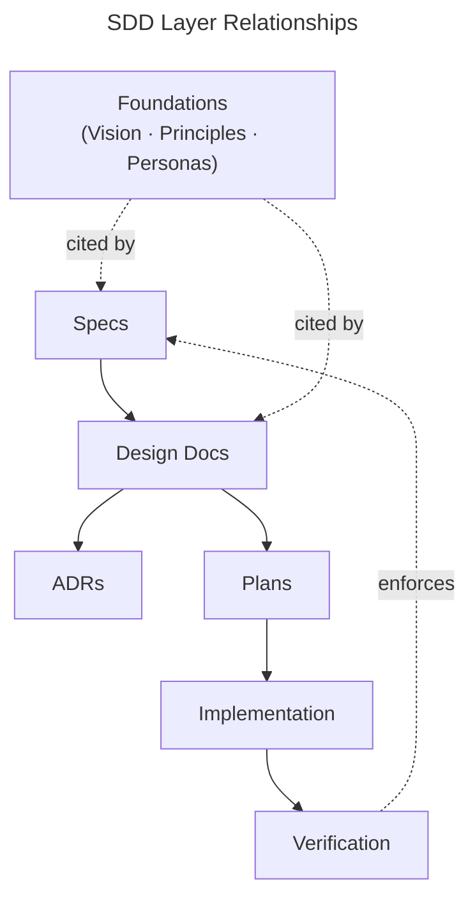

# SDD Development Process

Spec-Driven Development (SDD) as a method — the artifact layers, how work flows through them, and when each layer is required. Layers are defined functionally (what runs vs. what checks), not materially (Python vs. markdown).

Each project defines its own instantiation of the bottom two layers (what Implementation and Verification mean concretely) in a companion document named `<project>-implementation.md` alongside this file. Each directory README carries the detailed guidance for its layer — format, when-to-write rules, and templates.

## The Layer Stack

| Layer | Directory | Purpose | Audience | Changes When |
|-------|-----------|---------|----------|--------------|
| Foundations | `docs/foundations/` | Cross-cutting source material (vision, principles, personas) that feature artifacts cite rather than pass through | Contributors | Product identity or stances evolve |
| Specs | `docs/specs/` | Product intent — WHAT the project does | Contributors | Product vision changes |
| Design Docs | `docs/design/` | Technical architecture — high-level HOW | Contributors | Architecture evolves |
| ADRs | `docs/decisions/` | Decisions — WHICH choices and WHY | Future selves | New decision made |
| Plans | `docs/plans/` | Task breakdowns — WHAT to do in what order | Implementing agents | New feature started |
| Implementation | project-specific | Artifacts that perform operations | Executor (CPU or LLM) | Implementation improves |
| Verification | project-specific | Artifacts that confirm operations met their specs | CI, executor | Specs or implementation change |

Layers are ordered by abstraction. Specs are the most abstract (no implementation details). Verification is the most concrete (executable assertions or semi-mechanical checks). Each layer builds on the one above it.

## How Work Flows Through the Layers

Not every change touches every layer. The path depends on scope and nature.

### New Feature: Full Stack

Spec → Design Doc → ADRs → Branch → Plan → Implementation → Verification → Pull Request.

### Behavioral Change: Implementation + (maybe) ADR

Modifies HOW an existing feature works without changing WHAT it does. Skip specs and design docs. An ADR may be warranted if the change involves a non-obvious choice. Write a plan if the change involves multiple steps across files.

### Bug Fix or Tuning: Implementation or Verification Only

A threshold is wrong, a check has a bug, a configuration value needs adjustment. Touch only the affected layer. No spec, no design doc, no ADR unless the fix reveals a design flaw. A plan is still required if the fix touches multiple files.

### Worked examples

| Change | Path | Why |
|--------|------|-----|
| Add a new CLI command with new output | Full Stack | New user-visible capability → needs spec, design, plan |
| Add a new output section to an existing command | Full Stack (light) | New guarantee to users → spec update, maybe plan, skip design if pattern instantiation |
| Change the default threshold for a scoring algorithm | Behavioral Change | Same mechanism, different parameter → no spec, maybe ADR-lite if the default encodes a design choice |
| Reorder output sections for readability | Behavioral Change | Same content, different presentation → no spec, no ADR |
| Fix a regex that rejects valid input | Bug Fix | Broken behavior → touch implementation + test only |
| Adjust a config value that was set too aggressively | Bug Fix | Tuning → touch config only |
| Add a new mode to an existing command | Full Stack | New capability → spec (what the mode guarantees), design (how it composes with existing modes) |

## Document Authority

When two documents disagree, authority flows from abstract to concrete:

1. **Specs** — product invariants. If a spec says X must hold, X must hold.
2. **ADRs** — committed decisions. If an ADR says Y was decided, Y stands until superseded.
3. **Design Docs** — architectural intent. May drift as implementation evolves.
4. **Plans / Operations** — procedures. Must conform to specs and ADRs, not the reverse.
5. **AGENTS.md / README files** — entry points and indexes. Summaries here defer to the canonical source they reference.

If an operational runbook contradicts a spec invariant, the spec wins and the runbook must be updated (or the spec must be formally relaxed via a new ADR).

## Relationships Between Layers

<!-- Diagram: illustrates the directional relationships between SDD layers -->

*Figure 1. Foundations sit above the stack as source material. Specs drive design; design produces ADRs and plans; plans drive implementation; verification enforces specs.*

## Glossary

- **Behavioral change** — a modification that changes HOW an existing feature works without changing WHAT it guarantees.
- **Component boundary** — a distinct functional unit in the project's architecture (a script, a protocol, a schema, a CLI command).
- **Spec invariant** — a property declared in a spec's Invariants section that verification must check.
- **Non-trivial change** — a change that touches multiple files, introduces new behavior, or requires ordering of steps.
- **Pattern instantiation** — implementing a feature by following an architecture already documented in an accepted ADR or design doc, without introducing new mechanisms.
